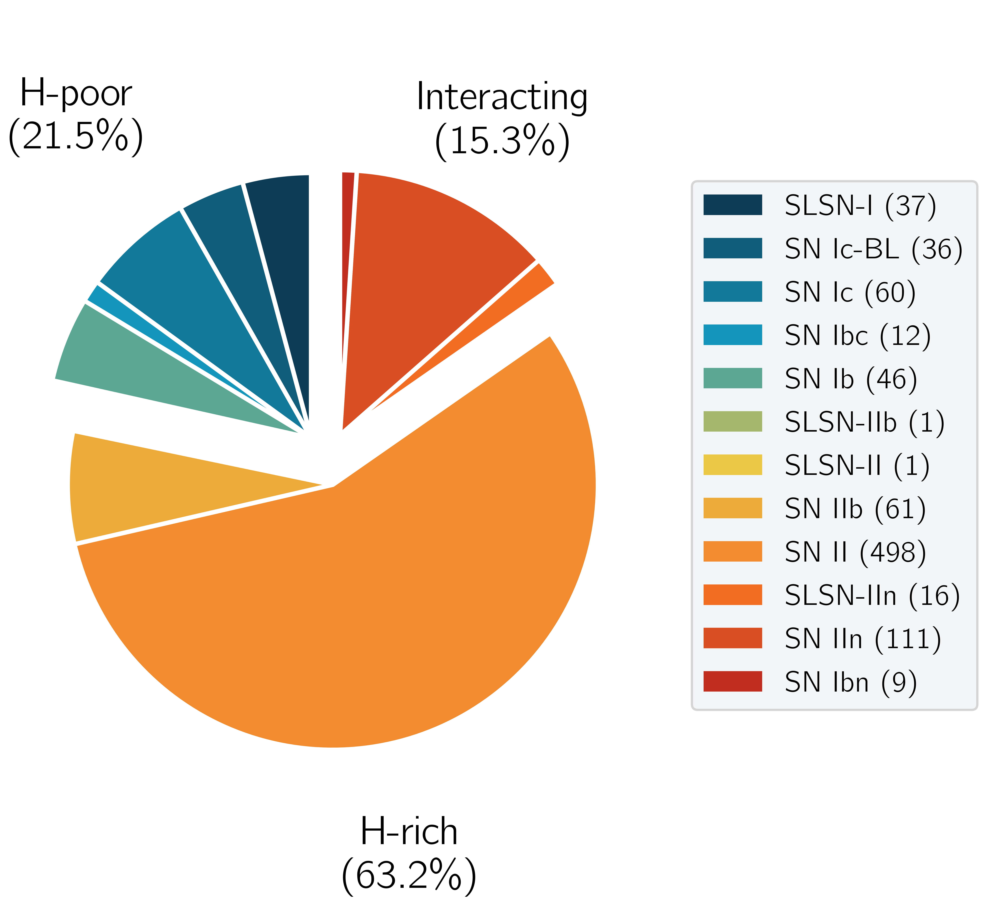

# Data Products of the Palomar Transient Factory Core-Collapse Supernova Sample

## Paper abstract

Several thousand core-collapse supernovae (CCSNe) of different flavors have been discovered so far. However, identifying their progenitors has remained an outstanding open question in astrophysics. Studies of SN host galaxies have proven to be powerful in providing constraints on the progenitor populations. In this paper, we present all CCSNe detected between 2009 and 2017 by the Palomar Transient Factory. This sample includes 888 SNe of 12 distinct classes out to redshift z=1. We present the photometric properties of their host galaxies from the far-ultraviolet to the mid-infrared and model the host-galaxy spectral energy distributions to derive physical properties. The galaxy mass functions of Type Ic, Ib, IIb, II, and IIn SNe ranges from 10^5 to 10^11.5 solar masses, probing the entire mass range of star-forming galaxies down to the least-massive star-forming galaxies known. Moreover, the galaxy mass distributions are consistent with models of star-formation-weighted mass functions. Regular CCSNe are hence direct tracers of star formation. Small but notable differences exist between some of the SN classes. Type Ib/c SNe prefer galaxies with slightly higher masses (i.e., higher metallicities) and star-formation rates than Type IIb and II SNe. These differences are less pronounced than previously thought. H-poor SLSNe and SNe Ic-BL are scarce in galaxies above 10^10 solar masses. Their progenitors require environments with metallicities of <0.4 and <1 solar, respectively. In addition, the hosts of H-poor SLSNe are dominated by a younger stellar population than all other classes of CCSNe. Our findings corroborate the notion that low-metallicity \textit{and} young age play an important role in the formation of SLSN progenitors.


## What is Palomar Transient Factory?

The Palomar Transient Factory (PTF) was the first untargeted deep wide-field synoptic survey. It was designed to systematically map out existing gaps in the transient phase-space and search for theoretically predicted but not yet detected phenomena. It used the 1.22 m (48 inch) Oschin Schmidt telescope (P48) at Mount Palomar (USA) and was operated between 2009 and mid-2017. The crucial advantages of the PTF survey were its large field of view of 7.2 square degrees, to monitor a large area of the night sky, and its well-matched spectroscopic resources, to routinely obtain spectra of even the faintest transients detected with the P48. Between 2009 and mid-2017, PTF discovered over 3000 SNe (> 2100 SNe Ia and >900 core-collapse SNe).

## The Core-Collapse Supernova Sample

The PTF CCSN consists of 888 SNe of 12 different SN classes. Figure [1](#fig:pie) shows the composition. The largest individual SN class in the PTF sample is the class of Type II SNe with 56% due to their high volumetric rate and their long-lasting plateaus, which are less demanding for the spectroscopic follow-up. On the other extreme, the Type Ibn SN sample contains only nine objects. Their light curves reach maxima within <10 days and afterward decline by 0.1 mag/day. Therefore, in order to classify them, spectroscopic observations within a few days after discovery are essential.

<figure class="image" id="fig:pie">
  
  <figcaption><b>Figure 1</b>: The PTF CCSN sample consists of 888 objects divided into three families and 12 classes.  The size of each subclassand family is shown in the legend.
</figcaption>
</figure>

About 45% of the PTF CCSN host galaxies have redshift information listed in the SDSS catalog or the NASA/IPAC Extragalactic Database. Spectra of 333 additional SNe (38%) show absorption or emission lines from their host galaxies.  The remaining 18% (158 SNe) have no redshift information. For those, we use the redshifts inferred by SN-template matching.

Figure [2](#fig:redshift) displays the redshift distribution of each SN class for their median values). The median redshifts reflect the average luminosity of each class. Type Ib, Ic, II, and IIb SNe have the lowest peak luminosities and are found only at low redshifts (median z=0.04). In contrast, SLSNe are detected at a median z=0.26. The most distant CCSN in our sample iPTF14tb is a H-poor SLSN at z=0.942.

<figure class="image" id="fig:redshift">
  
  <figcaption><b>Figure 2</b>: The redshift distribution of H-poor (left), H-rich (center), and interaction-powered (right) SNe. The stacked histograms are truncated at <i>z</i>=0.5 for presentation purposes, whereas the full distributions are shown as cumulative plots in the insets. The highest redshift SN in the PTF sample is the H-poor SLSN iPTF14tb at z=0.942.
</figcaption>
</figure>

In our paper, we presented the CCSN sample and photometric properties of their host galaxies from the far-ultraviolet to the mid-infrared. We model the host-galaxy spectral energy distributions to (i) deduce the distribution functions of the host-galaxy properties such as mass and star-formation rate, (ii) quantify the environment dependence for the production efficiency for the main SN classes, and (iii) indirectly constrain the progenitor properties for the largest CCSN classes.

## Conclusion

<figure class="image" id="fig:mass_distrib">
  
  <!-- <figcaption><b>Figure 3</b>: The redshift distribution of H-poor (left), H-rich (center), and interaction-powered (right) SNe. 
</figcaption> -->
</figure>

* The PTF CCSN sample probes the complete spectrum of star-forming galaxies from 10^5.4 to 10^11.3 solar masses, including galaxies comparable to the least massive least-massive star-forming galaxies in the Local Group (see the figure to the right). About 29% and 11% of the entire CCSN sample are found in galaxies less massive than 10^9 and 10^8 solar masses, respectively. About 3% of all regular CCSNe are found in starbursting galaxies with specific star-formation rates of >10^-8 yr^-1. If SLSNe are included the starburst frequency increases to 4.5%.

* Regular CCSNe (Type Ib/c, IIb, II, IIn) are direct tracers of star-formation. Their mass functions are consistent with those of the general population of star-forming galaxies weighted by their star-formation activity. The production efficiencies of their progenitor systems are close to independent of the _host-integrated_ metallicity and sSFR. Explosion site studies are needed to identify the true environmental differences between these SN classes.

* The mass, SFR and sSFR distribution functions of Type Ib, Ic, IIb and II SN host galaxies span the same ranges. However, the mass and SFR distribution functions of SN Ib+Ic+Ibc host galaxies (as individual classes and combined) are skewed towards galaxies with slightly higher masses and higher star-formation rates. These differences are less pronounced than in previous studies that were based on smaller and/or heterogeneous samples.

* H-poor SLSNe, as well as SNe Ic-BL, are biased tracers of star-formation. This bias can be corrected for by introducing a metallicity-dependent production efficiency. The occurrence of H-poor SLSNe and SNe Ic-BL is stifled above an oxygen abundance of 12+log O/H = 8.26 (0.4 solar metallicity) and =8.65 (=1 solar), respectively, confirming previous studies. In addition, H-poor SLSNe are found in galaxies with younger stellar-populations (10^8.3 vs. 10^9.7 yr) and higher specific star-formation rates >10^-8 yr^-1 (68\% vs. 3\%) than all other SN classes discussed in this paper. This lends further support to the notion that low-metallicity and young age play an important in the formation of SLSN progenitors. 

* The samples of H-rich SLSNe and Type Ibn SNe are still too small to conclude on whether their progenitors require special galaxy environments, e.g., low-metallicity galaxies.

On a more technical note

* Galaxy surveys with limiting magnitudes of 24.5 mag, such as the DESI Legacy Imaging Surveys, are sufficient to detect the host galaxies of almost every CCSN in transient surveys with limiting magnitudes of 21 mag. The host recovery-rate of SLSNe is lower due to their larger redshifts and their preference for low-luminosity galaxies.

* The probability distributions of the host properties are characterized by a Gaussian core with different levels of asymmetry and pronounced wings, in particular towards the faint end. These shapes are reminiscent of the underlying luminosity and mass functions of star-forming galaxies and need to be taken into account to identify singular CCSN host galaxies.

## Data products

We release a series of data products with the paper (will be continuously expanded).

1) [Photometry and SED modelling catalogue](catalog)

2) [Probability distribution functions of the host and SN properties](kde)

<!-- 3) [Postage stamps](poststamps) -->

<!-- 4) [Plots of the SED fits](sed)

5) Full SED output (after the acceptance of the paper) -->

## Reference

If you use data products of this paper, please cite [our paper](https://ui.adsabs.harvard.edu/abs/2020arXiv200805988S/abstract)

### Bibtex record

```
@ARTICLE{Schulze2020a,
       author = {{Schulze}, Steve and {Yaron}, Ofer and {Sollerman}, Jesper and
         {Leloudas}, Giorgos and {Gal}, Amit and {Wright}, Angus H. and
         {Lunnan}, Ragnhild and {Gal-Yam}, Avishay and {Ofek}, Eran O. and
         {Perley}, Daniel A. and {Filippenko}, Alexei V. and
         {Kasliwal}, Mansi M. and {Kulkarni}, Shri R. and {Nugent}, Peter E. and
         {Quimby}, Robert M. and {Sullivan}, Mark and {Linn Strothjohann}, Nora and
         {Arcavi}, Iair and {Ben-Ami}, Sagi and {Bianco}, Federica and
         {Bloom}, Joshua S. and {De}, Kishalay and {Fraser}, Morgan and
         {Fremling}, Christoffer U. and {Horesh}, Assaf and {Johansson}, Joel and
         {Kelly}, Patrick L. and {Knezevic}, Sladjana and {Maguire}, Kate and
         {Nyholm}, Anders and {Semeli Papadogiannakis}, 2 and
         {Petrushevska}, Tanja and {Rubin}, Adam and {Yan}, Lin and {Yang}, Yi and
         {Adams}, Scott M. and {Bufano}, Filomena and {Clubb}, Kelsey I. and
         {Foley}, Ryan J. and {Green}, Yoav and {Harmanen}, Jussi and
         {Ho}, Anna Y.~Q. and {Hook}, Isobel M. and {Hosseinzadeh}, Griffin and
         {Howell}, D. Andrew and {Kong}, Albert K.~H. and {Kotak}, Rubina and
         {Matheson}, Thomas and {McCully}, Curtis and {Milisavljevic}, Dan and
         {Pan}, Yen-Chen and {Poznanski}, Dovi and {Shivvers}, Isaac and
         {van Velzen}, Sjoert},
        title = "{The Palomar Transient Factory Core-Collapse Supernova Host-Galaxy Sample. I. Host-Galaxy Distribution Functions and Environment-Dependence of CCSNe}",
      journal = {arXiv e-prints},
     keywords = {Astrophysics - Astrophysics of Galaxies},
         year = 2020,
        month = aug,
          eid = {arXiv:2008.05988},
        pages = {arXiv:2008.05988},
archivePrefix = {arXiv},
       eprint = {2008.05988},
 primaryClass = {astro-ph.GA},
       adsurl = {https://ui.adsabs.harvard.edu/abs/2020arXiv200805988S},
      adsnote = {Provided by the SAO/NASA Astrophysics Data System}
}
'''